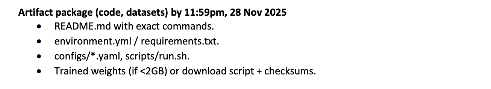

### Steps



##### Setting up of environment
1. Detail setup - requirements.txt

##### Data Collection and Benchmark Creation
1. Download all files using the first download.py and extract.py to get the following:
    - HTML (./data/edersoncorbari_subtitles_html)
    - video clips (./data/video)
    - .srt files (./data/tvqa_subtitles_friends)
2. Run parse_subtitles_annotate.py to get data/benchmark/annotated_tuples/
3. Run event generation code? on data/benchmark/annotated_tuples/ -> data/benchmark/episodic_tuples/
4. Run question-answer generation code? on data/benchmark/episodic_tuples/ -> data/benchmark/episodic_qa/
5. Benchmark Creation - End result
    - annotated tuples from Step 3 in data/benchmark/episodic_tuples/
    - qa-pairs from Step 4 in data/benchmark/episodic_qa/

##### Vanilla Inference
1. Download all the necessary models as specified in models/model.py
2. run_vanilla_inference.py
3. results are saved to ./results_vainlla/

##### Goldfish Inference
1. Code and citation?
**Citation**
```
@misc{ataallah2024goldfishvisionlanguageunderstandingarbitrarily,
      title={Goldfish: Vision-Language Understanding of Arbitrarily Long Videos}, 
      author={Kirolos Ataallah and Xiaoqian Shen and Eslam Abdelrahman and Essam Sleiman and Mingchen Zhuge and Jian Ding and Deyao Zhu and Jürgen Schmidhuber and Mohamed Elhoseiny},
      year={2024},
      eprint={2407.12679},
      archivePrefix={arXiv},
      primaryClass={cs.CV},
      url={https://arxiv.org/abs/2407.12679}, 
}
@article{ataallah2024minigpt4,
  title={MiniGPT4-Video: Advancing Multimodal LLMs for Video Understanding with Interleaved Visual-Textual Tokens},
  author={Ataallah, Kirolos and Shen, Xiaoqian and Abdelrahman, Eslam and Sleiman, Essam and Zhu, Deyao and Ding, Jian and Elhoseiny, Mohamed},
  journal={arXiv preprint arXiv:2404.03413},
  year={2024}
}
```

##### Run Evaluation
1. Locate evaluation scripts?
2. Run evaluation scripts?
3. Results saved to?